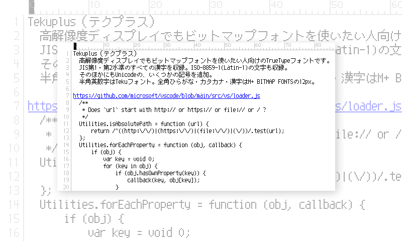
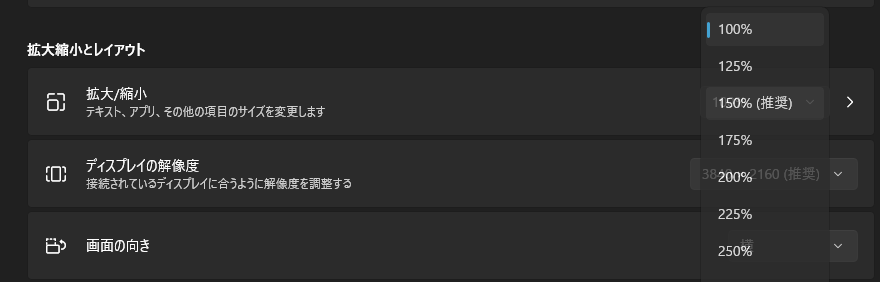
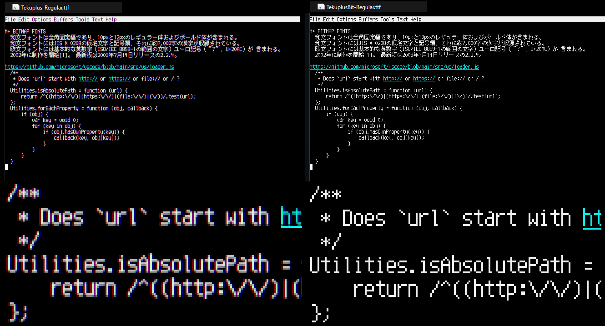

English [日本語](./README_ja.md)

Tekuplus
========

TrueType fonts for Japanese with bitmap fonts on high-resolution (HiDPI) displays

Download
--------

<https://github.com/itouhiro/Tekuplus/releases>

Feature
-------

* Tekuplus-(Regular|Bold).ttf
    * TrueType Outline fonts without embedded bitmaps.
    * Latin-1(ISO-8859-1) set, and Japanese JIS level-1 and level-2 kanji set.
    * Designed from
      [Teku font](https://github.com/itouhiro/tekufont) for Latin-1, and
      [M+ BITMAP FONTS](https://mplus-fonts.osdn.jp/mplus-bitmap-fonts/) for kanji.

* TekuplusBit-(Regular|Bold).ttf
    * Bitmaps are embedded in TrueType Outline fonts.
    * There are 3 bitmap sizes: 12, 24, 36 pixel.
      (24 and 32 pixel are just scaled up 2 or 3 times from 12 pixel)
    * Embedded Bitmaps are available in these point sizes.
        | display scale| point size for Windows  |
        | ------------ | ------------------------|
        | 100％        | 9pt,    18pt,   27pt    |
        | 150％        | 6.75pt, 13.5pt, 20.25pt |
        | 200％        | 4.5pt,  9pt,    13.5pt  |
        | 300％        | 3pt,    6pt,    9pt     |

License
-------

M+ FONT LICENSE  
(see [LICENSE.md](./LICENSE.md))

Copyright (C) 2022-2024 itouhiro  
Copyright (C) 2002-2005 M+ FONTS PROJECT

History
-------

* 2024-12-12  Version 2024.1212
    * UPDATE: dingbat glyphs
    * UPDATE: build process
    * UPDATE: doc

* 2023-10-10  Version 2023.1010
    * FIX: change ambiguous glyphs from half-width to full-width
    * ADD: add dingbat glyphs  

* 2022-03-03  Version 2022.0303  
    * UPDATE: change 'S' glyph to distinguish from '5'

* 2022-02-22  Version 2022.0222  
    * first release

Detailed Explanation
--------------------

Windows 11 allows users to adjust the "Display Scale" to accommodate high-resolution displays (HiDPI).  
For example, if text and icons appear too small at 100% scale,
you can increase the scale to 200% to make them larger.

Figure 1: Display Scale (Settings > System > Display > Scale)  

To display fonts with embedded bitmaps, the following settings can be used:

- Font "TekuplusBit 9pt"
    - Set the font size in the application settings

Figure 2: Difference between outline (Tekuplus) and embedded bitmap (TekuplusBit)  

However, at a 200% display scale, the embedded bitmap would not be used
even for a "9pt" font and would instead display in outline form.
To resolve this, the bitmap scaled 2x in both directions was embedded,
ensuring that the embedded bitmap would be used even at 200% display scale.

Additionally, bitmaps scaled 3x in both directions are also embedded,
though it's unclear whether 300% scaling is commonly used.  
A 4x scaled bitmap could be embedded by modifying the source code,
but it would increase the font file size, so this was not done.

Difference from PixelMplus
--------------------------

This font is a sibling of [PixelMplus](https://github.com/itouhiro/PixelMplus).
Both are created in the same way.

The difference is as follows:

|                        | PixelMplus       | Tekuplus        | TekuplusBit     |
| ---------------------- | ---------------- | --------------- | --------------- |
| **Japanese glyph**     | M+ BITMAP FONTS  | M+ BITMAP FONTS | M+ BITMAP FONTS |
| **alphanumeric glyph** | M+ BITMAP FONTS  | Teku font       | Teku font       |
| **font size**          | 10pixel, 12pixel | 12pixel only    | 12pixel only    |
| **embedded bitmap**    | -                | -               | ✓              |

Teku font above is a self-made alphanumeric bitmap font.
