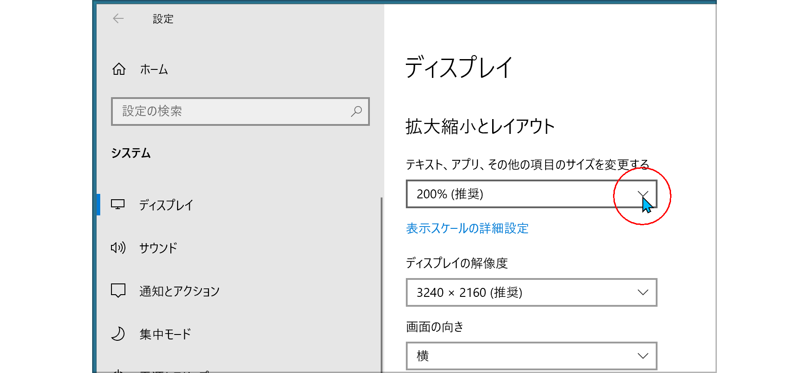
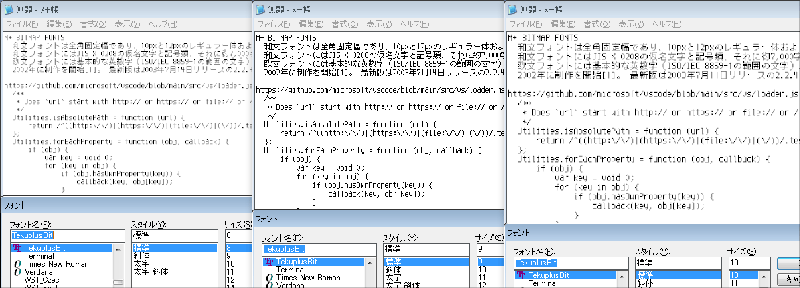
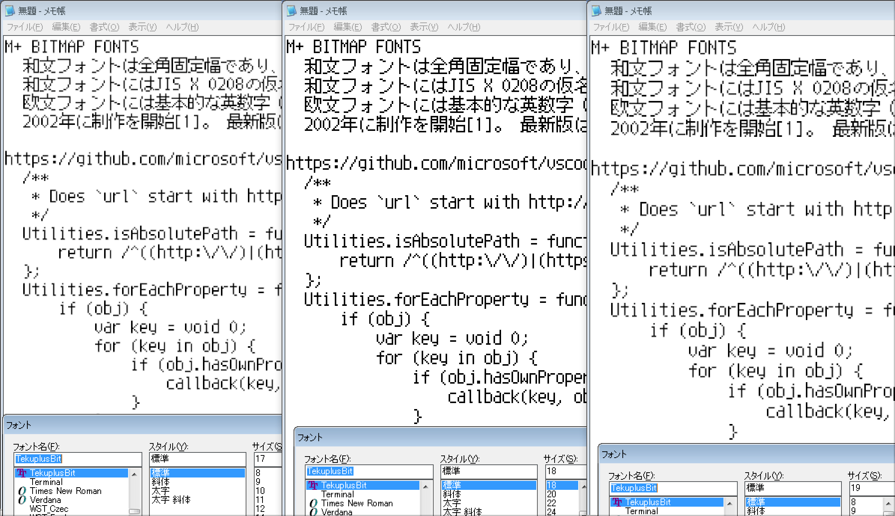
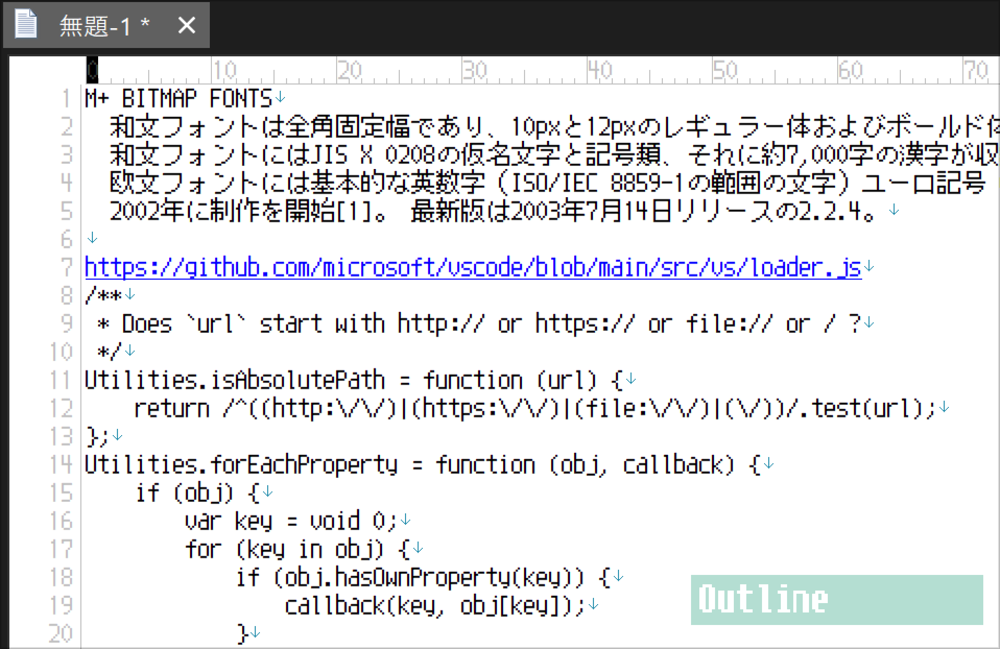
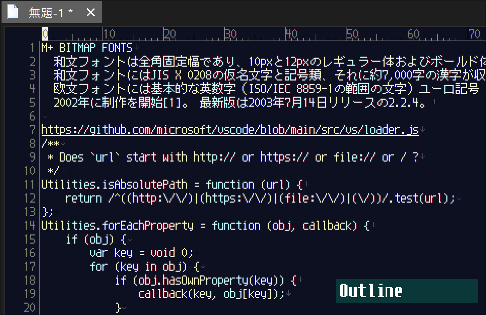

Tekuplus
========

TrueType fonts for Japanese bitmap-font-lovers on HiDPI.

Feature
-------

* Tekuplus-(Regular|Bold).ttf
    * TrueType Outline fonts without embedded bitmaps.
    * Latin-1(ISO-8859-1) set, and Japanese JIS level-1 and level-2 kanji set.
    * Designed from
      [Teku font](https://github.com/itouhiro/tekufont) for Latin-1, and
      [M+ BITMAP FONTS](https://mplus-fonts.osdn.jp/mplus-bitmap-fonts/) for kanji.

* TekuplusBit-(Regular|Bold).ttf
    * Bitmaps are embedded in TrueType Outline fonts.
    * There are 3 bitmap sizes: 12, 24, 36 pixel.
      (24 and 32 pixel are just scaled up 2 or 3 times from 12 pixel)
    * Embedded Bitmaps are available in these point sizes.
        | display scale| point size for Windows  |
        | ------------ | ------------------------|
        | 100％        | 9pt,    18pt,   27pt    |
        | 150％        | 6.75pt, 13.5pt, 20.25pt |
        | 200％        | 4.5pt,  9pt,    13.5pt  |
        | 300％        | 3pt,    6pt,    9pt     |

License
-------

M+ FONT LICENSE  
(see [LICENSE.md](./LICENSE.md))

Copyright (C) 2022 itouhiro  
Copyright (C) 2002-2005 M+ FONTS PROJECT

History
-------

* 2022-03-03  Version 2022.0303  
        Change 'S' glyph to distinguish from '5'

* 2022-02-22  Version 2022.0222  
        First Release

----

## Tekuplus（テクプラス）

高解像度ディスプレイでもビットマップフォントを使いたい人向けのTrueTypeフォントです。

特徴
----

* ビットマップフォントのように見えるが、アウトライン等幅TrueTypeフォント。
  ビットマップを埋め込んだバージョンも用意。

* JIS第1・第2水準のすべての漢字を収録。ISO-8859-1(Latin-1)の文字も収録。
  そのほかにもPixelMplus由来の、いくつかの記号を追加。

* ライセンスは自由な M+ FONT LICENSE。

* 半角英数字は [Tekuフォント](https://github.com/itouhiro/tekufont)。
  全角ひらがな・カタカナ・漢字は
  [M+ BITMAP FONTS](https://mplus-fonts.osdn.jp/mplus-bitmap-fonts/) の12px。

* Tekuplus は埋め込みビットマップなし。
  TekuplusBit は埋め込みビットマップあり。
  埋め込みビットマップは以下の3つ。

    * 12ピクセル
    * 24ピクセル（12ピクセルと同じものを単に2倍拡大）
    * 36ピクセル（12ピクセルと同じものを単に3倍拡大）

  Windowsでは以下のポイント指定で、埋め込みビットマップを使えるはず。
  ただし小数点を含むサイズは指定できないアプリが多い。13.5ptは指定できるアプリもある。

    | 表示スケール | ポイント                |
    | ------------ | ------------------------|
    | 100％        | 9pt,    18pt,   27pt    |
    | 150％        | 6.75pt, 13.5pt, 20.25pt |
    | 200％        | 4.5pt,  9pt,    13.5pt  |
    | 300％        | 3pt,    6pt,    9pt     |

説明
----

Windows 10は「表示スケール」の拡大で、高解像度ディスプレイ(HiDPI)に対応できます。

たとえばノートパソコンには、ディスプレイが15インチで「3240x2160ピクセル」の機種があります。これを表示スケール 100％で使うと、アイコンも小さいし何より文字が小さくて読みにくい。

そこで、表示スケールを200％にすると、まるで「1620x1080ピクセル」のディスプレイに表示しているかのようなアイコンや文字の大きさになります。これなら文字も通常の大きさに表示されて読みやすい。

図1. Windows 10の「設定＞システム＞ディスプレイ＞表示スケール」

しかし表示スケール 100％のとき使われていた 9ポイントの埋め込みビットマップは、表示スケール 200％では使われずに、アウトライン表示になってしまいます。
そこで、単に 2倍拡大したビットマップも埋め込むことで、表示スケールを 200％にしても、埋め込みビットマップを使われるようにしました。

表示スケール 100％のときは、

* 埋め込みビットマップで表示しているとき（9pt、18pt）
* アウトラインで表示しているとき（8pt、10pt、17pt、19pt）

の差は大きいので、見ればすぐに違いがわかります。

図2. 表示スケール 100％でサイズ 8,9,10ptを指定

図3. 表示スケール 100％でサイズ 17,18,19ptを指定

表示スケール 200％のときは、差が少なくなります。
同じ 9ptで、文字色も同じときの差は以下です。

* アウトラインで表示しているときは、文字色が、蛍光灯やネオン管のような不安定さを感じさせます。
* 埋め込みビットマップで表示しているときは、文字色が、道路に書かれた白線のように安定して見えます。

図4. 表示スケール 200％でサイズ 9ptを指定して、文字は黒、背景は白。アウトライン表示と埋め込みビットマップを交互に表示

図5. 表示スケール 200％でサイズ 9ptを指定して、文字は白、背景は黒。アウトライン表示と埋め込みビットマップを交互に表示

