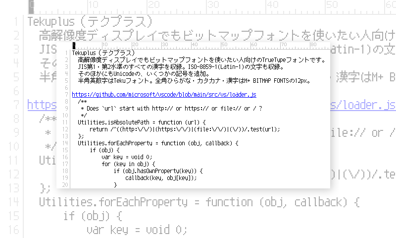
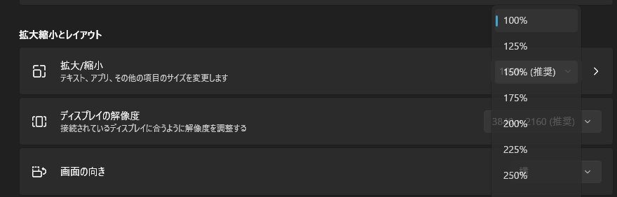
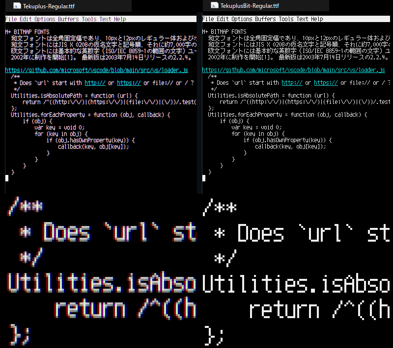

[English](./README.md) 日本語

Tekuplus（テクプラス）
======================

高解像度ディスプレイでもビットマップフォントを使いたい人向けのTrueTypeフォントです。

ダウンロード
------------

<https://github.com/itouhiro/Tekuplus/releases>

特徴
----

* ビットマップフォントのように見えるが、アウトライン等幅TrueTypeフォント。
  ビットマップを埋め込んだバージョンも用意。

* JIS第1・第2水準のすべての漢字を収録。ISO-8859-1(Latin-1)の文字も収録。
  そのほかにもUnicodeの、いくつかの記号を追加。

* ライセンスは自由な M+ FONT LICENSE。

* 半角英数字は [Tekuフォント](https://github.com/itouhiro/tekufont)。
  全角ひらがな・カタカナ・漢字は
  [M+ BITMAP FONTS](https://mplus-fonts.osdn.jp/mplus-bitmap-fonts/) の12px。

* Tekuplus は埋め込みビットマップなし。
  TekuplusBit は埋め込みビットマップあり。
  埋め込みビットマップは以下の3つ。

    * 12ピクセル
    * 24ピクセル（12ピクセルと同じものを単に2倍拡大）
    * 36ピクセル（12ピクセルと同じものを単に3倍拡大）

  Windowsでは以下のポイント指定で、埋め込みビットマップを使えるはず。
  ただし小数点を含むサイズは指定できないアプリが多い。

    | 表示スケール | ポイント                |
    | ------------ | ------------------------|
    | 100％        | 9pt,    18pt,   27pt    |
    | 150％        | 6.75pt, 13.5pt, 20.25pt |
    | 200％        | 4.5pt,  9pt,    13.5pt  |
    | 300％        | 3pt,    6pt,    9pt     |

詳細説明
--------

Windows 11は、高解像度ディスプレイ(HiDPI)に対応するため、「表示スケール」を変更できる。  
たとえば、表示スケール 100％ では文字やアイコンの見え方が小さすぎるとき、表示スケール 200％ にすることで大きく表示できる。

図1. 表示スケール（設定＞システム＞ディスプレイ＞拡大/縮小）  

このフォントは、以下のように設定すれば、埋め込みビットマップで表示できる。

- フォント「TekuplusBit  9ポイント」
    - アプリの設定でフォントの大きさを指定する

図2. アウトライン（Tekuplus）と、埋め込みビットマップ（TekuplusBit）の違い  

しかし、表示スケール 200％のときは、同じ「9ポイント」でも埋め込みビットマップが使われずに、アウトライン表示になる問題があった。  
そこで、単に 縦横 2倍拡大したビットマップも埋め込むことで、表示スケールを 200％にしても、埋め込みビットマップを使われるようにした。

念のため、縦横 3倍拡大したビットマップも埋め込んでいる。だが、表示スケール300％を使う環境が実際にあるのかは不明。  
縦横 4倍拡大したビットマップもソースコードを変更すれば埋め込むことはできるが、フォントのファイルサイズが大きくなるので、やっていない。

PixelMplusとの違い
------------------

このフォントは [PixelMplus](https://github.com/itouhiro/PixelMplus) の兄弟フォントだ。同じ作り方で作っている。  
違いは以下になる。

|                          | PixelMplus       | Tekuplus        | TekuplusBit     |
| ------------------------ | ---------------- | --------------- | --------------- |
| **日本語の字体**         | M+ BITMAP FONTS  | M+ BITMAP FONTS | M+ BITMAP FONTS |
| **英数字の字体**         | M+ BITMAP FONTS  | Teku font       | Teku font       |
| **フォントサイズ**       | 10pixel, 12pixel | 12pixelのみ     | 12pixelのみ     |
| **埋め込みビットマップ** | なし             | なし            | あり            |

上記の Teku fontは、自作の英数字ビットマップフォント。
